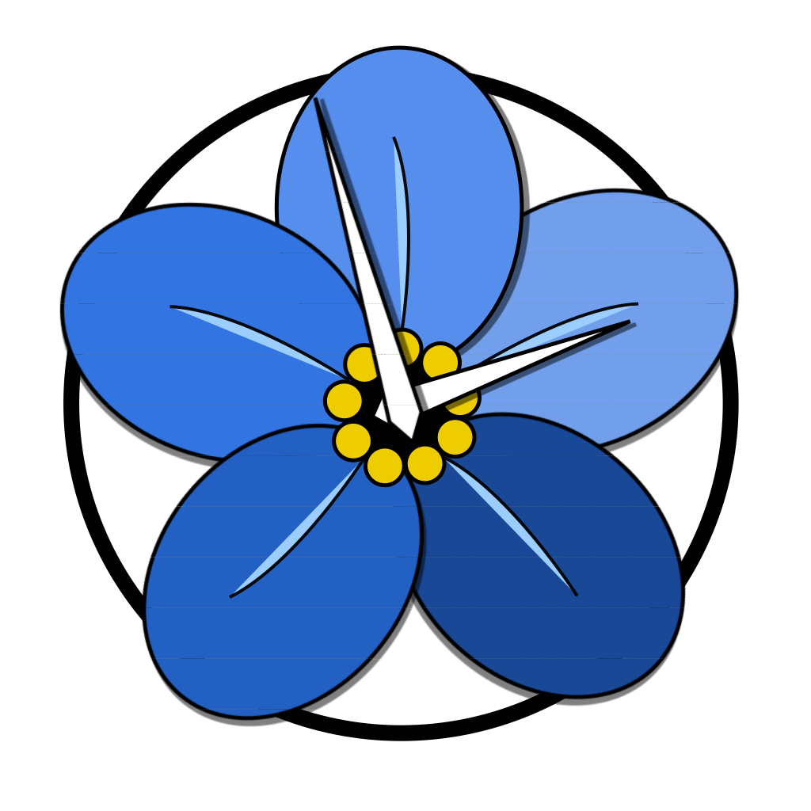

<p align="center">

</p>

# "Forget Me Not" - Final Project
This is the source code to our group final project and will serve as an electronic archive.

## Description
With this application, we aim to create an interactive framework that users can use to manage their own personal garden. The application allows users to insert each of their garden plants into a database, and then the application will notify the user with reminders regarding when it is time to care for their plants. It also connects to the OpenWeather API to warn the user about incoming harmful weather. 

Users can link and view images of each of their plants to see how they have grown over time. The application is gamified to create a more enjoyable experience for the user as well as to incentivize future use.

## Features
### Water & Weather Notifications
The application sends notifications to the user to remind them that it is time to water their plants. Then the user can go into the app and confirm that they successfully watered their plants within the Plant Dashboard.

It also sends a notification that is prompted by hazardous weather conditions that serves to remind the user that they need to bring their outdoor plants indoors.

### Plants Dashboard
The application allows users to see their collection of plants all in one place.

Users can scroll through their plants and see the corresponding information (name, type, location, age, and the date they were last watered). Users can also add more plants with the “Add Plant” feature.

Long clicking the plant will indicate that the user has watered the plant and will update the last watered time accordingly.


### Points & Badges System
Gamification is a great way to drive user engagement and draw new users towards your application. Our implementation focuses upon the innate human joy found in collecting shiny trinkets.

These badges were custom made for the purposes of this application. The badges fall under these 5 categories: 
1. Consistency
2. Diversity
3. Photographer
4. Green Thumb
5. Badge of Badges.


Below are a selection of potential badges a user can earn:
<p align="center">


</p>

You can view the rest of the badges in [this repository](https://github.com/MobileAppEngg-Group1-Fall2019/Badges).


### Images/Gallery
The application provides the user with a gallery function that allows the user to select one of their plants by name and display all of their images of that plant. The user can also use the gallery to link photos on their phone to their plants for easy access later.

# Group #1 Members

- [Feng, Yuqing](https://github.com/sunnyfeng)
- [Kewalramani, Manish](https://github.com/muhneesh)
- [Nguyen, Daniel](https://github.com/DanNguyen-CE)
- [Zheng, Felix](https://github.com/fezheng397)

```
Mobile App Engineering & User Experience Design [ECE 453]  
Janne Lindqvist
Rutgers University F'2019
```
