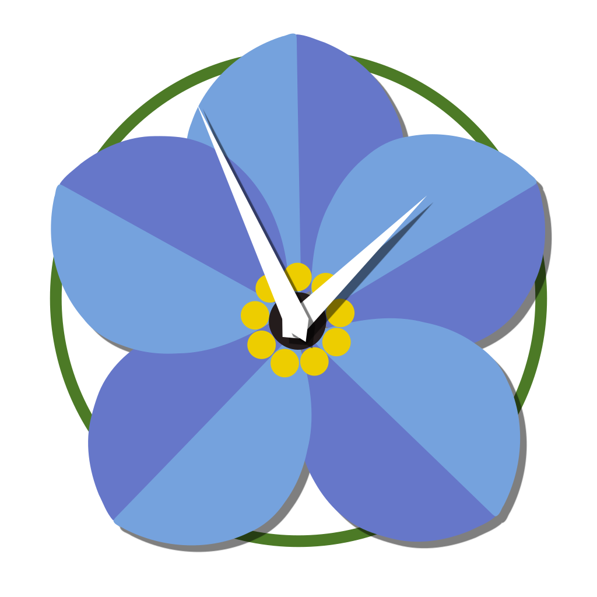

<p align="center">

</p>

# "Forget Me Not" - Final Project
This is the source code to our group final project and will serve as an electronic archive.

## Description
TODO
## Features
### Watering Notifications
TODO

### Points & Badges System
In order to make the application more appealing and enganging to the user, we used gamification. This means that the user will be able to earn points based on how well they take care of their plants. Certain achivements are rewarded with badges. The user is able to see the badges and points to show off to their friends!

Below are a selection of potential badges a user can earn:
<p align="center">


</p>

### Weather Notifications
TODO

### Images/Gallery
TODO

### Plant Health Tracking & Watering History
TODO

# Group #1 Members

- [Feng, Yuqing](https://github.com/sunnyfeng)
- [Kewalramani, Manish](https://github.com/muhneesh)
- [Nguyen, Daniel](https://github.com/DanNguyen-CE)
- [Zheng, Felix](https://github.com/fezheng397)

```
Mobile App Engineering & User Experience Design [ECE 453]  
Janne Lindqvist
Rutgers University F'2019
```
